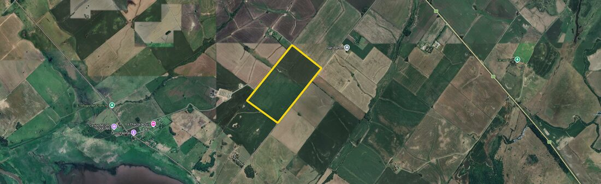
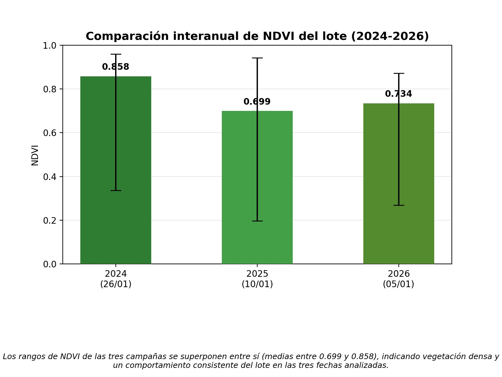
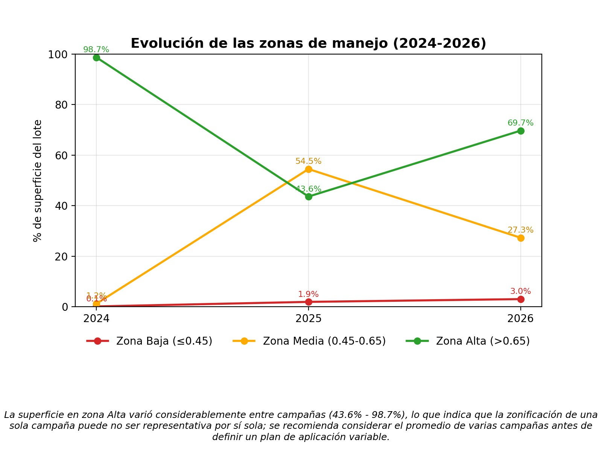
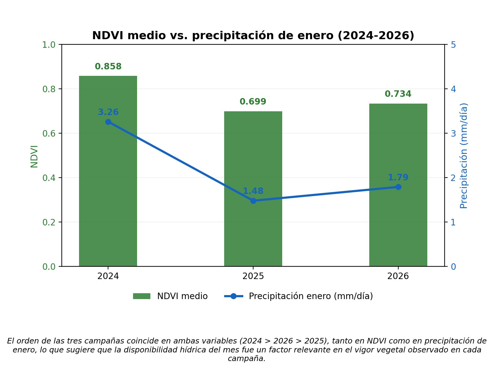
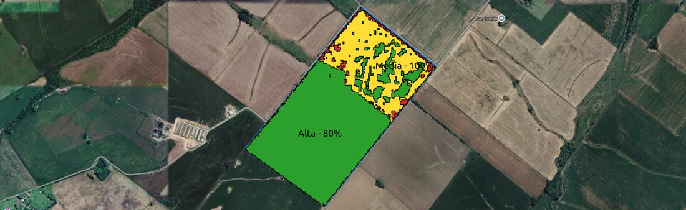
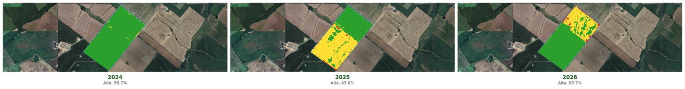
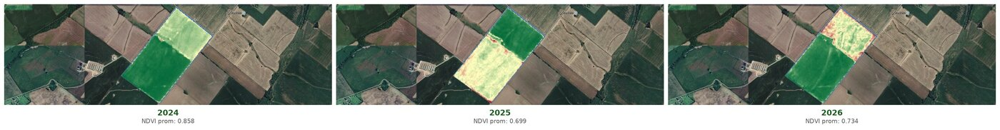

# Análisis Satelital de un Lote Agrícola — NDVI, Zonificación de Manejo y VRA

Pipeline en **Python (PyQGIS) + QGIS 3.44** para monitoreo de un lote agrícola mediante
teledetección: cálculo de NDVI, zonificación de manejo, comparación interanual, contexto
climático y generación de un mapa de prescripción para aplicación variable (VRA).

Proyecto Personal — Curso *"SIG y Satélites para el Agro"*, Centro REDES.

*Lote de 84 ha en una zona de lomadas de Entre Ríos, Argentina (cercanías de Victoria).*

## Qué hace este proyecto

- Descarga y valida bandas Sentinel-2 (B04/B08), incluyendo detección de escenas con datos
  corruptos o contaminadas por nubes antes de procesar.
- Calcula NDVI y lo reclasifica en zonas de manejo (bajo/medio/alto vigor).
- Compara el NDVI y la zonificación del lote a lo largo de **tres campañas** (2024-2026) para
  evaluar si el patrón espacial es estable en el tiempo.
- Cruza los resultados con datos de precipitación (NASA GPM IMERG, vía Giovanni) para
  contextualizar climáticamente las diferencias entre campañas.
- Genera un **mapa de prescripción vectorial (VRA)** con dosis relativa sugerida por zona,
  exportado en un formato que un equipo de aplicación variable podría usar directamente.

## Resultados clave (campaña 2026)

| Métrica | Valor |
|---|---|
| Superficie del lote | 84 ha (0.84 km²) |
| NDVI medio | 0.734 |
| Precipitación media de enero | 1.79 mm/día |
| Superficie en zona de vigor Alto | 69.7% |

### NDVI interanual (2024-2026)

Los tres años muestran vegetación densa (NDVI promedio entre 0.699 y 0.858), con rangos que
se superponen entre sí.

### Zonificación de manejo — no es estable entre campañas

Hallazgo relevante del proyecto: la proporción de superficie en zona de vigor Alto varió de
98.7% (2024) a 43.6% (2025) y a 69.7% (2026). Esto muestra que basar una recomendación de
manejo diferenciado en una sola imagen satelital puede no ser representativo — conviene
promediar varias campañas.

### NDVI vs. precipitación

El orden de las tres campañas coincide en ambas variables (2024 > 2026 > 2025), sugiriendo
que la disponibilidad hídrica de enero fue un factor relevante — aunque con solo 3 puntos de
datos esto es una observación cualitativa, no una correlación estadísticamente robusta.

### Mapa de prescripción VRA (campaña 2026)

Zonificación vectorizada con dosis relativa sugerida: **120%** en zona Baja, **100%** en
Media, **80%** en Alta (lógica de fertilización nitrogenada variable: subir dosis donde el
vigor es bajo, bajarla donde ya es alto, para homogeneizar el canopeo).

## Galería — zonificación de manejo y NDVI (2024-2026)

**Zonas de manejo** (rojo = vigor bajo, amarillo = medio, verde = alto):

**NDVI** (escala de color roja-amarilla-verde, relativa al rango de cada campaña):

## Scripts

Diseñados para correr desde la Consola de Python de QGIS (Editor, no el prompt interactivo
línea por línea — bloques `def`/`for` se rompen si se pegan directo en el prompt).

| Script | Qué hace |
|---|---|
| [`01_calcular_ndvi.py`](scripts/01_calcular_ndvi.py) | Recorta B04/B08 al lote y calcula NDVI = (B08−B04)/(B08+B04) |
| [`02_reclasificar_zonas_manejo.py`](scripts/02_reclasificar_zonas_manejo.py) | Reclasifica el NDVI en zonas Baja/Media/Alta y calcula % de superficie |
| [`03_generar_prescripcion_vra.py`](scripts/03_generar_prescripcion_vra.py) | Vectoriza las zonas y genera el mapa de prescripción con dosis relativa |
| [`04_grafico_ndvi_comparativo.py`](scripts/04_grafico_ndvi_comparativo.py) | Gráfico de barras del NDVI interanual con conclusión automática |
| [`05_grafico_zonas_evolucion.py`](scripts/05_grafico_zonas_evolucion.py) | Gráfico de línea de la evolución de zonas de manejo |
| [`06_grafico_ndvi_precipitacion.py`](scripts/06_grafico_ndvi_precipitacion.py) | Gráfico combinado NDVI vs. precipitación (doble eje) |
| [`07_parser_precipitacion_giovanni.py`](scripts/07_parser_precipitacion_giovanni.py) | Parser de los CSV de NASA Giovanni (sin pandas), unifica mensual/diario a mm/día |

## Metodología

1. Delimitación del polígono del lote sobre imagen satelital de alta resolución.
2. Descarga de bandas B04 (roja) y B08 (infrarrojo cercano) de Sentinel-2 L2A
   (Copernicus Data Space Ecosystem).
3. Recorte de ambas bandas al límite exacto del lote.
4. Cálculo de NDVI y reclasificación en zonas de manejo discretas.
5. Contexto climático con datos de precipitación GPM IMERG (NASA), vía la plataforma Giovanni.

Todo el procesamiento se realizó en **QGIS 3.44 en Linux**, usando la Consola de Python para
automatizar el recorte, el cálculo del índice y la reclasificación, sin depender de
complementos de terceros para estos cálculos.

## Control de calidad de datos

Dos problemas reales se detectaron y corrigieron durante el procesamiento, antes de que
llegaran a afectar los resultados finales:

- **Datos en cero:** las primeras descargas de banda para enero de 2024 traían reflectancia
  cero en toda la escena (archivo corrupto de origen). Se detectó verificando `min/max/media`
  de cada banda antes de procesar, y se resolvió descargando una fecha alternativa.
- **Contaminación por nubes:** la primera imagen usable de 2025 tenía una fina cobertura de
  neblina que distorsionaba el NDVI calculado (0.213 en vez de un valor realista). Se detectó
  comparando la capa True Color de esa fecha, y se corrigió con una fecha alternativa sin
  nubosidad (NDVI real: 0.699).

## Fuentes de datos

- European Space Agency — Copernicus Data Space Ecosystem: Sentinel-2 MSI Level-2A.
  <https://browser.dataspace.copernicus.eu/>
- Huffman, G.J. et al. — GPM IMERG Final Precipitation L3 1 month V07 (GPM_3IMERGM) y
  GPM IMERG Late Precipitation L3 1 day V07 (GPM_3IMERGDL). NASA GES DISC.
- Acker, J.G. & Leptoukh, G. (2007). *Online analysis enhances use of NASA Earth science
  data.* Eos, Transactions American Geophysical Union, 88(2), 14–17.
- QGIS.org — QGIS Geographic Information System (v3.44).
- Rouse, J.W. et al. (1974). *Monitoring vegetation systems in the Great Plains with ERTS.*
  NASA Special Publication, 351, 309–317.

## Autor

Sebastián Zárate — Rosario, Argentina
